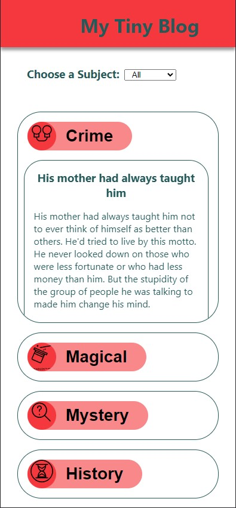
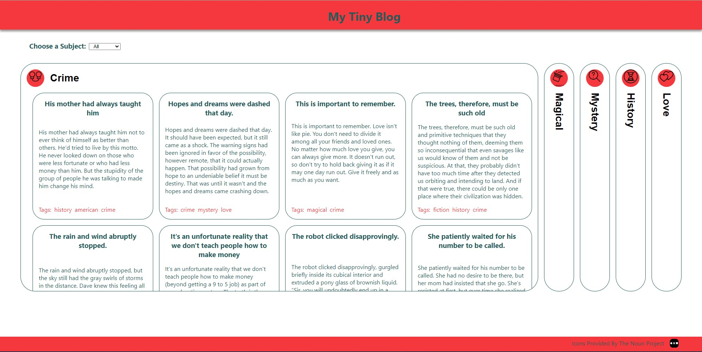

# My Tiny Blog

This project was built to work on my TypeScript skills, as well as continue practice of React functionality.  I utilised CSS and attribute selectors to target state changes in the displayed topics, to allow for the accordion effect.

## UI

The UI passes data from the JSON received and sorts the posts into 5 categories based upon their "tags". These categories are stored in the Utils file, as the constant "filter" - changes to this will change the filtered subjects shown (though a new icon willl be needed for the new subject).

Once sorted, each blog section, then maps out the relevant posts, to be displayed once the section is selected.

Efforts were made to make the UI compatible with screen readers using best practices. The UI is also responsive to keyboard use via tabbing and entering, for accessibility. 

I used in-element scrolling to display relevant posts, while maintaining a clean UI.

 

## Responsiveness

The UI is mobile-responsive, showing the subjects stacked vertically on narrower screens:

 

and horizontally on full width screens:

 

## Tools

This project was bootstrapped with [Create React App](https://github.com/facebook/create-react-app).

The data used for each "blog entry" comes from the DummyJSON API.

## Attribution 

Icons used for each topic come from the Noun Project:
[crime](https://thenounproject.com/browse/icons/term/crime/) - Crime Icon by Kawalan Icon 
[love](https://thenounproject.com/browse/icons/term/love/) - Love by PEBIAN 
[mystery](https://thenounproject.com/browse/icons/term/mystery/) - Mystery by Kawalan Icon 
[magical](https://thenounproject.com/browse/icons/term/magical-hat/) - Magical Hat by Moch Rizki Eko Waluyo 
[history](https://thenounproject.com/browse/icons/term/history/) - History by myiconfinder 